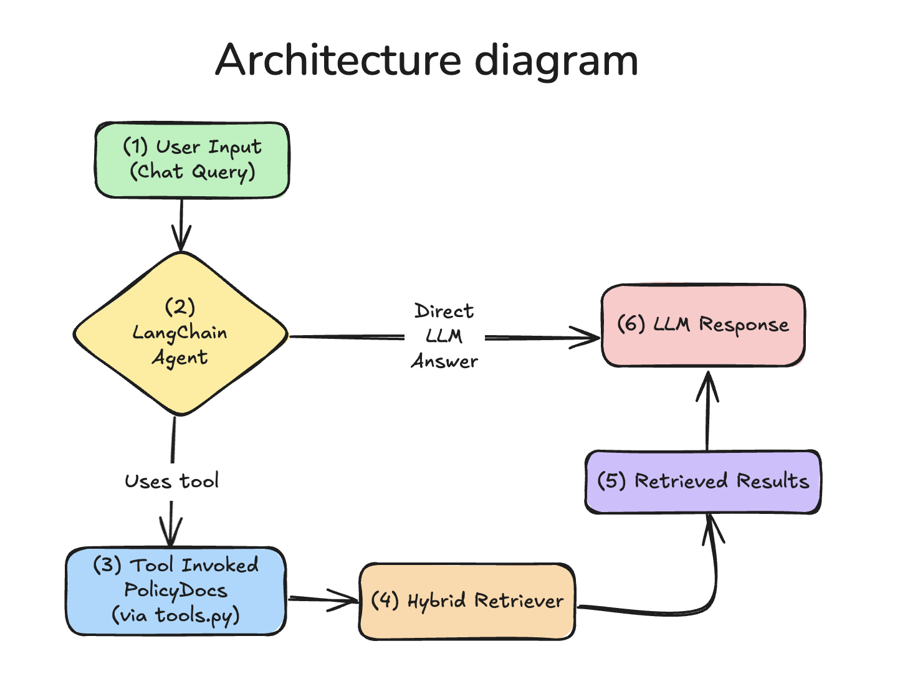

🧾 HRBot: Internal Policy Chatbot
=================================

This is a local AI-powered chatbot that answers HR and company policy questions using LangChain, OpenAI, and a hybrid retriever (BM25 + vector search). The frontend is built with Next.js, and the backend logic runs in Python.

⚙️ Requirements
Node.js ≥ 18
Python ≥ 3.10
pip
OpenAI API key
[optional] virtualenv

🚀 Setup Instructions
---------------------

cd travel_chatbot
python3 -m venv .venv
source .venv/bin/activate
pip install -r requirements.txt

1. Clone the Repository
```bash
git clone https://github.com/yourname/hrbot.git
cd hrbot
```

2. Setup Python Environment
```bash
cd travel_chatbot
python3 -m venv .venv
source .venv/bin/activate
pip install -r requirements.txt
```
Create a .env file in the root folder (or export manually):
```bash
export OPENAI_API_KEY=your-api-key-here
```

3. Build the Retriever (1st time only)
```bash
python src/tools.py
```
This will process all .md files in knowledge_base/ and build a local vector store.

4. Run the Frontend
```bash
cd ui
npm install
npm run dev
```
Open http://localhost:3000 to chat with the bot.

🧠 How It Works
---------------

- Load Policy Docs: All .md files in the knowledge_base/ directory are loaded using DirectoryLoader, split into overlapping chunks with RecursiveCharacterTextSplitter, and optionally persisted to disk via Chroma.

- Hybrid Retrieval: 
   - Dense retrieval via OpenAI embeddings and Chroma
   - Sparse retrieval via BM25
   - Combined using an EnsembleRetriever

- Contextual Compression:
Retrieved documents are compressed using LLMChainExtractor, which uses an OpenAI model to summarize only the most relevant content for each query.

- Query Rewriting + Clarification:
   - Follow-up questions are clarified using conversation history (ConversationSummaryBufferMemory)
   - Rewritten for better retrieval results using a dedicated LLMChain

- Tool Use & Agent Logic:
   - The LangChain agent (CHAT_CONVERSATIONAL_REACT_DESCRIPTION) is initialized with memory and the PolicyDocs tool
   - Based on the query, the agent decides whether to use the tool or answer directly using its own reasoning
- Answer Generation:
The final response is returned via print(json.dumps(...)), and captured by the Next.js API route to be displayed in the UI.

Architecture Diagram
---------------



1. User Input: A user types a natural language question like "What is the reimbursement policy for home office equipment?"

2. LangChain Agent: Uses your system prompt (SYSTEM_PROMPT) to guide the assistant’s tone and behavior. It decides whether to answer directly or call a tool. If there's chat history, the follow-up is clarified via a prompt to make it self-contained (clarify_followup()).

3. Tool Call – PolicyDocs: The agent routes the query to the policy_docs_tool, which is responsible for retrieving document-based answers.

4. Hybrid Retriever:
- Loads markdown documents from the knowledge_base/
- Chunks them for easier handling
- Uses dense vector search (OpenAIEmbeddings) and BM25 (sparse) in an ensemble
- Compresses the results using a LLM extractor for better context

5. Retrieved Results: The top relevant, compressed documents are returned to the agent.

6. LLM Response: The agent uses the documents to generate and return a grounded, clear answer to the user.

🧩 Customization
----------------
- Expand Knowledge Base
Add or update .md files in the knowledge_base/ folder to enrich the system’s understanding. The content will be indexed automatically on first run or when the vector store is rebuilt.

- Add New Tools
Modify tools.py to define new tools tailored to specific types of questions (e.g., salary calculators, time-off policies). Then include them in the tool_list.

- Refine System Prompt
Adjust the SYSTEM_PROMPT in prompts.py to change the assistant’s tone, formality, or role (e.g., make it more empathetic, more concise, or specialized for certain departments).

- Tune Retrieval Behavior
Modify retrieval.py to adjust chunking strategy, number of documents retrieved, or add new retrieval mechanisms.

- Add Query Preprocessing
Improve how queries are rewritten or clarified by modifying clarify_followup or rewrite_query logic in tools.py.

- Change LLM Parameters
Adjust the model temperature or switch to another model (e.g., GPT-4) by changing the configuration in policy_agent.py.


🔮 Future Improvements
----------------
While the current implementation of the HR policy chatbot demonstrates strong retrieval capabilities and contextual awareness, there are several areas where the system could be enhanced:

- Persistent Vector Database:
Currently, the Chroma vector store is stored locally and may be rebuilt on each run if not properly persisted. Moving to a production-grade vector database (e.g., Pinecone, Weaviate) would improve scalability and performance.

- Feedback and Ranking Loop:
The chatbot has no mechanism for collecting feedback on the quality of responses. Implementing a feedback system (e.g., thumbs-up/down or a rating prompt) would allow ranking and refinement of future outputs based on user input.

- Retrieval Weight Optimization:
The EnsembleRetriever currently assigns equal weights (0.5, 0.5) to dense and sparse retrievers. These weights are arbitrary and not empirically validated. Future iterations could explore data-driven or adaptive weighting strategies based on domain and query type.

- Improved Tool Routing:
At present, the agent uses a single tool (PolicyDocs). Introducing specialized tools (e.g., one for benefits, another for leave policies) and adding a classifier to route queries more precisely would improve accuracy.

- Scalable Memory:
The ConversationSummaryBufferMemory is sufficient for short interactions but may struggle with multi-turn, long-session memory. Future versions could incorporate persistent memory or vector-based memory systems for better context tracking.

- Production-Ready Deployment:
The backend relies on spawning a local Python process from the frontend, which is not suitable for cloud deployments like Vercel. To scale, the Python logic could be containerized (e.g., using Docker + FastAPI) and deployed on a serverless backend with a stable API endpoint.